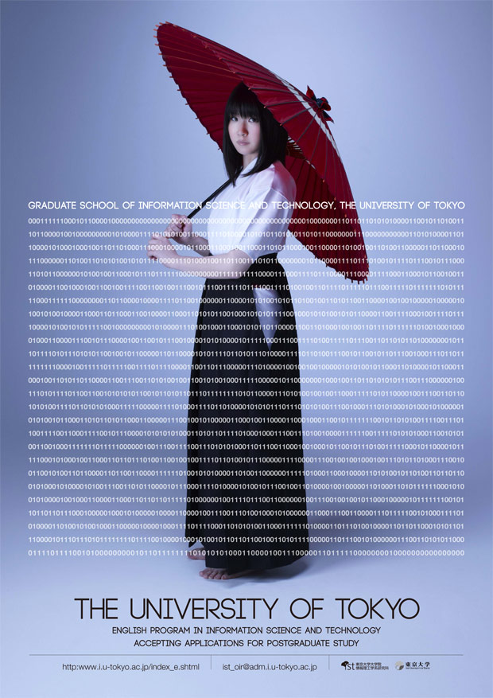

# University of Tokyo Graduate School of Information Science and Technology Special Entrance Examination for the 2011 Doctoral Program

## 0x00 Foreword

It was in end of 2012 when I first saw this poster. The exam or puzzle attracts me deeply and leads me to be a CSer.

## 0x01 Poster

Ther original source is [here][1].

There are also [Japanese][2] version and [Chinese][3] version.

## 0x02 Extract Source

The basic idea is to use OCR to get all the source data. But it can also be done manuall.

The extracted result can be see [here](./src.txt).

**TODO**: implementing with OCR. 

[1]: http://www.i.u-tokyo.ac.jp/ist_en/library/posters/2011-poster_en.shtml
[2]: http://www.i.u-tokyo.ac.jp/ist_en/library/posters/2011-poster_ja.shtml
[3]: http://www.i.u-tokyo.ac.jp/ist_en/library/posters/2011-poster_c.shtml